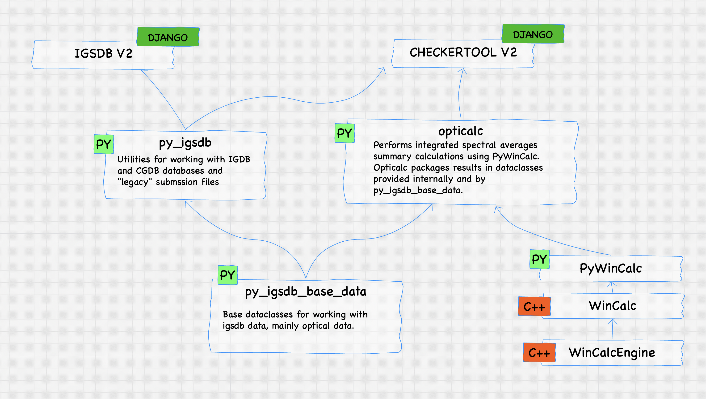

# Opticalc

Opticalc is a Python library used to generate integrated spectral averages summary values for
single glazing and shading layers. It uses https://github.com/LBNL-ETA/pywincalc to perform these 
calculations. Pywincalc is a thin wrapper around the C++ library https://github.com/LBNL-ETA/wincalc.

Opticalc is used primarily by Checkertool V2.

Opticalc attempts to abstract away the peculiarities of pywincalc,
as well as add some helpful dataclasses and Enums to describe the type of data needed to calculate
integrated spectral averages summaries. Opticalc also relies on foundational dataclasses defined
in the https://github.com/LBNL-ETA/py_igsdb_base_data library.

Why not include this logic directly in Pywincalc? Pywincalc is generated programmatically from wincalc and does
not have much in the way of custom, Python-based logic and classes that help a user make sense of the types and shapes
of data and the nature of various operations. Opticalc serves as a location for this extra Python-based code.

# License

NOTICE. This Software was developed under funding from the U.S. Department of Energy and the U.S. Government
consequently retains certain rights. As such, the U.S. Government has been granted for itself and others acting on its
behalf a paid-up, nonexclusive, irrevocable, worldwide license in the Software to reproduce, distribute copies to the
public, prepare derivative works, and perform publicly and display publicly, and to permit other to do so.

Berkeley Lab WINDOW Calc Engine (CalcEngine) Copyright (c) 2016 - 2019, The Regents of the University of California,
through Lawrence Berkeley National Laboratory (subject to receipt of any required approvals from the U.S. Dept. of
Energy). All rights reserved.

If you have questions about your rights to use or distribute this software, please contact Berkeley Lab's Innovation &
Partnerships Office at IPO@lbl.gov.
